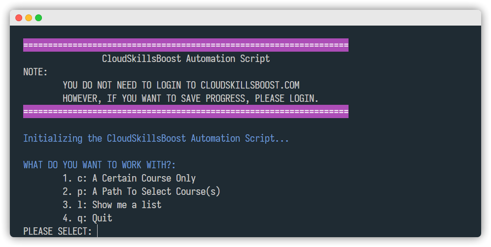
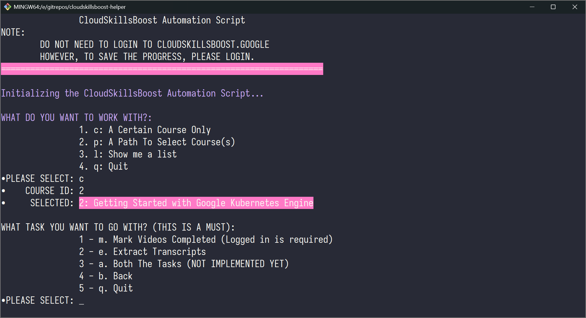
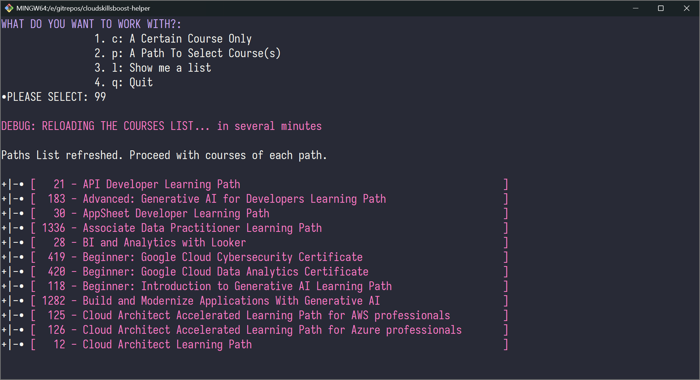
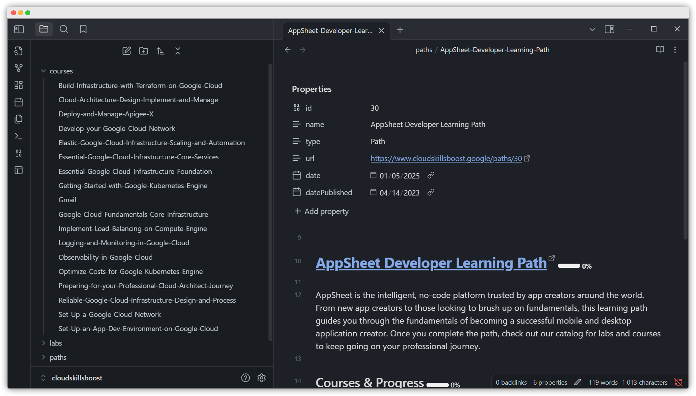
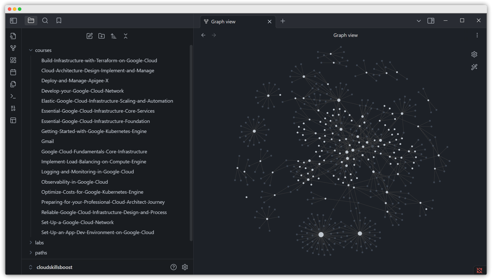
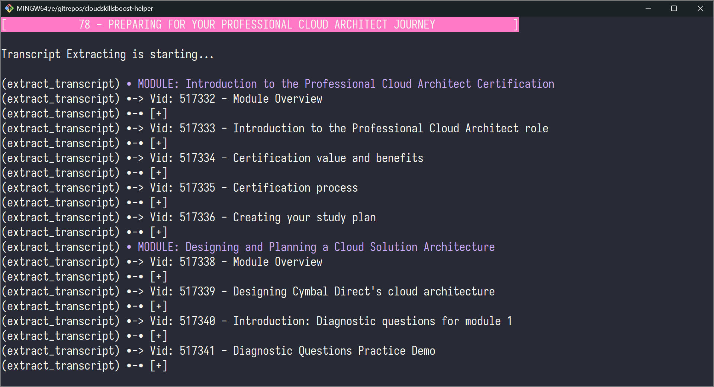

# Google Cloud Skills Boost Automation/Scraping Script



A helper or a scraper.

This is a small tools for scraping contents from Google Cloud Skills Boost website to Markdown files, which helps to build your Personal Knowledge Base, Obsidian, for example.

## Features

- Gathers a list of Path.
- Offer selection to specify a course or list of courses.
- Extract the course(s)' content, including id, title, tag, videos' transcript, and quiz.
- Write path's or course's content to a well-structured Markdown file for each.
- Can also help to 'Mark Complete Video' as well.
- Generate prompt for LLM to re-formatting the videos' transcripts.

## TODO

- Command-line interface.
- Do not over-write the existing Markdown files, it's actually up to you, as a user.
- Call to Gemini/LLAMA or any other LLM for helping summarize/re-formatting the transcripts.
    + For time being, Gemini for me, is not so good so I don't use yet.
    + LM Studio is a good choice with LLAMA 3.1, 3.2 but my machine is not suitable for running this continously.

Check [CONTRIBUTION](CONTRIBUTION.md) for more.

## I. Installation - A Manual Approach

### 1. Clone the repo

```sh
git clone https://github.com/samdx/cloudskillsboost-helper.git
cd cloudskillsboost-helper
```

### 2. Create a Virtual Environment

You can create a virtual environment using `venv`:

```sh
python -m venv .venv
```

### 3. Activate the Virtual Environment

- **Windows**:

  ```sh
  .venv\Scripts\activate
  ```

- **macOS/Linux**:

  ```sh
  source .venv/bin/activate
  ```

### 4. Install Packages from `requirements.txt`

Once the virtual environment is activated, you can install the packages listed in `requirements.txt`:

```sh
pip install -r requirements.txt
```

## II. Installation - Automating the Process

There is a script to automate the entire process.

#### `setup_env.sh`

Linux/macOS:

```sh
#!/bin/sh

# Create virtual environment
python -m venv .venv

# Activate virtual environment
. .venv/Scripts/activate

# Install packages
pip install -r requirements.txt
```

Windows:

```sh
#!/bin/sh

# Create virtual environment
python -m venv .venv

# Activate virtual environment
. .venv/bin/activate

# Install packages
pip install -r requirements.txt
```

### Running the Script

Make the script executable and run it:

```sh
chmod +x setup_env.sh
./setup_env.sh
```

### III. Optional - Using `pipenv`

Alternatively, you can use `pipenv` to manage your virtual environment and dependencies in one step:

1. **Install `pipenv`**:
   ```sh
   pip install pipenv
   ```

2. **Create Virtual Environment and Install Packages**:
   ```sh
   pipenv install -r requirements.txt
   ```

3. **Activate the Virtual Environment**:
   ```sh
   pipenv shell
   ```

## IV. Usage

```bash
python main.py
```

### Specify The Task You Want To Go With

1. (`c`) Specify a certain course's ID to go with.
2. (`p`) Specify a certain path's ID to go with, from there you can select a(ll) or a certain course to continue.
3. (`l`) List out all the recorded Path and continue.



### Hidden Menu

- `99`: **To Fetch Courses List For Each Of The Paths on the first run.** Use this to download all Paths details prior to do anything else later on.
- `5`: Generate prompt for downloaded/fetched course. Output will be save to `data/courses/{course-id-number}-prompt.json`.



## Database

### `data` Folder

- No database for this actually, it's JSON-based database.
- All Path, Course, Lab details and content will be saved to the `data` folder and subfolders.

### `id.json` and JSON Files

- `courses.json`: a `dict [str, str]` of all the known courses, downloaded or not.
- `labs.json`: a `dict [str, str]` of all the known labs, downloaded only.
- `paths.json`: a `dict [str, str]` of all the known paths, downloaded or not.
- `{number}.json`: a `dict [str, str | dict [str, Any]]` of either a Path, or Course or Lab within respetive folder.

```
data
|--- courses.json
|--- labs.json
|--- paths.json
|--- courses
|----- 20.json
|--- labs
|----- 100.json
|--- paths
|----- 12.json
```

## Output folder

- The same structure to the above *database* folder.
- All files are Markdown.
- Instead of `id`, the file name is the course/path/lab' names stripped out all the special characters and no more spaces.

```
[your output folder here]
|---courses
|---- A-Course-Name-Here.md
|---labs
|----- A-Lab-Name-Here.md
|---paths
|----- A-Path-Name-Here.md
```

## Example of Obsidian

File View.



Graph View.



The script in action.


