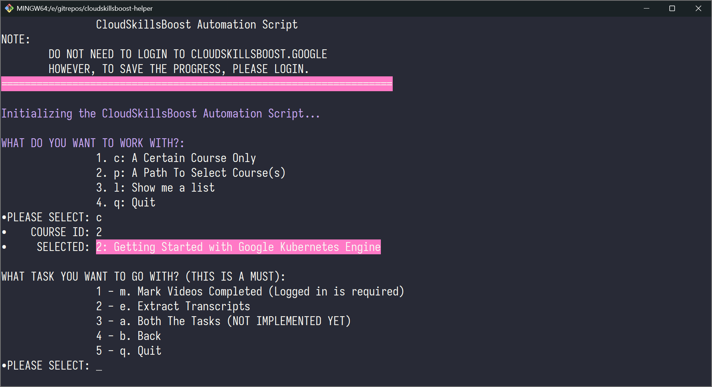

## IV. Usage

- On the first run, please use the `99` [hidden menu](#hidden-menu) to gather all the Paths first.
- This is because no data file will be shipped with the application.

### Starting Up

```bash
python scraper.py
```

### Specify The Task You Want To Go With

1. (`c`) Specify a certain course's ID to go with.
2. (`p`) Specify a certain path's ID to go with, from there you can select a(ll) or a certain course to continue.
3. (`l`) List out all the recorded Path and continue.



### Hidden Menu

- `99`: **To Fetch Courses List For Each Of The Paths on the first run.** Use this to download all Paths details prior to do anything else later on.
- `5`: Generate prompt for downloaded/fetched course. Output will be save to `data/courses/{course-id-number}-prompt.json`.


